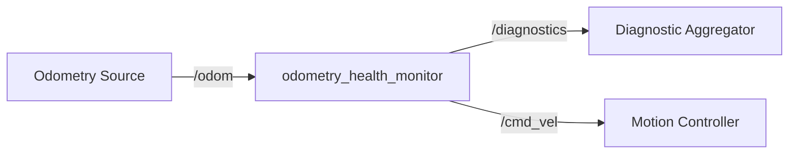

**User:**

<task>
Generate complete documentation for the odometry_health_monitor 
package following the standard doc structure.
</task>
<environment_details>
# VSCode Visible Files
../../../Downloads/ros2 recovery.md

# VSCode Open Tabs
../../../Downloads/ros2 recovery.md

# Current Time
Current time in ISO 8601 UTC format: 2026-05-16T15:22:42.439Z
User time zone: Europe/Madrid, UTC+2:00

# Current Cost
$0.00

# Review Exclusions
The following file patterns are excluded from code reviews:
- .vscode/**

# Current Mode
<slug>ros2-docs-architect</slug>
<name>ROS 2 Docs Architect</name>


# Current Workspace Directory (/home/bb/hackathon/IBM/BobForBot) Files
app.py
bob session.md
LICENSE
README.md
requirements-ui.txt
.bob/
.streamlit/
bob-sessions/
bob-sessions/README.md
bobpilot-pack/
bobpilot-pack/.bob/
bobpilot-ros2-mcp/
bobpilot-ros2-mcp/demo_run.py
bobpilot-ros2-mcp/fault_narrator.py
bobpilot-ros2-mcp/requirements.txt
bobpilot-ros2-mcp/server.py
demo_outputs/
demo_outputs/.gitkeep
demo_outputs/safety_report_safety_manager.md
demo_outputs/safety_report.md
demo_outputs/tool_results.json
demo-robot-workspace/
demo-robot-workspace/README.md
demo-robot-workspace/SEEDED_FAULTS.md
demo-robot-workspace/build/.built_by
demo-robot-workspace/build/COLCON_IGNORE
demo-robot-workspace/build/odometry_health_monitor/colcon_build.rc
demo-robot-workspace/build/odometry_health_monitor/colcon_command_prefix_setup_py.sh
demo-robot-workspace/build/odometry_health_monitor/colcon_command_prefix_setup_py.sh.env
demo-robot-workspace/build/odometry_health_monitor/colcon_test.rc
demo-robot-workspace/build/odometry_health_monitor/install.log
demo-robot-workspace/build/odometry_health_monitor/build/lib/odometry_health_monitor/__init__.py
demo-robot-workspace/build/odometry_health_monitor/build/lib/odometry_health_monitor/odometry_health_monitor_node.py
demo-robot-workspace/build/odometry_health_monitor/odometry_health_monitor.egg-info/dependency_links.txt
demo-robot-workspace/build/odometry_health_monitor/odometry_health_monitor.egg-info/entry_points.txt
demo-robot-workspace/build/odometry_health_monitor/odometry_health_monitor.egg-info/PKG-INFO
demo-robot-workspace/build/odometry_health_monitor/odometry_health_monitor.egg-info/requires.txt
demo-robot-workspace/build/odometry_health_monitor/odometry_health_monitor.egg-info/SOURCES.txt
demo-robot-workspace/build/odometry_health_monitor/odometry_health_monitor.egg-info/top_level.txt
demo-robot-workspace/build/odometry_health_monitor/odometry_health_monitor.egg-info/zip-safe
demo-robot-workspace/build/odometry_health_monitor/prefix_override/sitecustomize.py
demo-robot-workspace/install/
demo-robot-workspace/install/_local_setup_util_ps1.py
demo-robot-workspace/install/_local_setup_util_sh.py
demo-robot-workspace/install/.colcon_install_layout
demo-robot-workspace/install/COLCON_IGNORE
demo-robot-workspace/install/local_setup.bash
demo-robot-workspace/install/local_setup.ps1
demo-robot-workspace/install/local_setup.sh
demo-robot-workspace/install/local_setup.zsh
demo-robot-workspace/install/setup.bash
demo-robot-workspace/install/setup.ps1
demo-robot-workspace/install/setup.sh
demo-robot-workspace/install/setup.zsh
demo-robot-workspace/install/odometry_health_monitor/
demo-robot-workspace/install/odometry_health_monitor/bin/
demo-robot-workspace/install/odometry_health_monitor/bin/odometry_health_monitor_node
demo-robot-workspace/install/odometry_health_monitor/lib/
demo-robot-workspace/install/odometry_health_monitor/lib/python3.10/
demo-robot-workspace/install/odometry_health_monitor/lib/python3.10/site-packages/
demo-robot-workspace/install/odometry_health_monitor/lib/python3.10/site-packages/odometry_health_monitor/
demo-robot-workspace/install/odometry_health_monitor/lib/python3.10/site-packages/odometry_health_monitor/__init__.py
demo-robot-workspace/install/odometry_health_monitor/lib/python3.10/site-packages/odometry_health_monitor/odometry_health_monitor_node.py
demo-robot-workspace/install/odometry_health_monitor/lib/python3.10/site-packages/odometry_health_monitor-0.1.0-py3.10.egg-info/
demo-robot-workspace/install/odometry_health_monitor/lib/python3.10/site-packages/odometry_health_monitor-0.1.0-py3.10.egg-info/dependency_links.txt
demo-robot-workspace/install/odometry_health_monitor/lib/python3.10/site-packages/odometry_health_monitor-0.1.0-py3.10.egg-info/entry_points.txt
demo-robot-workspace/install/odometry_health_monitor/lib/python3.10/site-packages/odometry_health_monitor-0.1.0-py3.10.egg-info/PKG-INFO
demo-robot-workspace/install/odometry_health_monitor/lib/python3.10/site-packages/odometry_health_monitor-0.1.0-py3.10.egg-info/requires.txt
demo-robot-workspace/install/odometry_health_monitor/lib/python3.10/site-packages/odometry_health_monitor-0.1.0-py3.10.egg-info/SOURCES.txt
demo-robot-workspace/install/odometry_health_monitor/lib/python3.10/site-packages/odometry_health_monitor-0.1.0-py3.10.egg-info/top_level.txt
demo-robot-workspace/install/odometry_health_monitor/lib/python3.10/site-packages/odometry_health_monitor-0.1.0-py3.10.egg-info/zip-safe
demo-robot-workspace/install/odometry_health_monitor/share/
demo-robot-workspace/install/odometry_health_monitor/share/ament_index/
demo-robot-workspace/install/odometry_health_monitor/share/ament_index/resource_index/
demo-robot-workspace/install/odometry_health_monitor/share/ament_index/resource_index/packages/
demo-robot-workspace/install/odometry_health_monitor/share/ament_index/resource_index/packages/odometry_health_monitor
demo-robot-workspace/install/odometry_health_monitor/share/colcon-core/
demo-robot-workspace/install/odometry_health_monitor/share/colcon-core/packages/
demo-robot-workspace/install/odometry_health_monitor/share/colcon-core/packages/odometry_health_monitor
demo-robot-workspace/install/odometry_health_monitor/share/odometry_health_monitor/
demo-robot-workspace/install/odometry_health_monitor/share/odometry_health_monitor/package.bash
demo-robot-workspace/install/odometry_health_monitor/share/odometry_health_monitor/package.dsv
demo-robot-workspace/install/odometry_health_monitor/share/odometry_health_monitor/package.ps1
demo-robot-workspace/install/odometry_health_monitor/share/odometry_health_monitor/package.sh
demo-robot-workspace/install/odometry_health_monitor/share/odometry_health_monitor/package.xml
demo-robot-workspace/install/odometry_health_monitor/share/odometry_health_monitor/package.zsh
demo-robot-workspace/install/odometry_health_monitor/share/odometry_health_monitor/config/
demo-robot-workspace/install/odometry_health_monitor/share/odometry_health_monitor/config/params.yaml
demo-robot-workspace/install/odometry_health_monitor/share/odometry_health_monitor/hook/
demo-robot-workspace/install/odometry_health_monitor/share/odometry_health_monitor/hook/ament_prefix_path.dsv
demo-robot-workspace/install/odometry_health_monitor/share/odometry_health_monitor/hook/ament_prefix_path.ps1
demo-robot-workspace/install/odometry_health_monitor/share/odometry_health_monitor/hook/ament_prefix_path.sh
demo-robot-workspace/install/odometry_health_monitor/share/odometry_health_monitor/hook/path.dsv
demo-robot-workspace/install/odometry_health_monitor/share/odometry_health_monitor/hook/path.ps1
demo-robot-workspace/install/odometry_health_monitor/share/odometry_health_monitor/hook/path.sh
demo-robot-workspace/install/odometry_health_monitor/share/odometry_health_monitor/hook/pythonpath.dsv
demo-robot-workspace/install/odometry_health_monitor/share/odometry_health_monitor/hook/pythonpath.ps1
demo-robot-workspace/install/odometry_health_monitor/share/odometry_health_monitor/hook/pythonpath.sh
demo-robot-workspace/install/odometry_health_monitor/share/odometry_health_monitor/hook/pythonscriptspath.dsv
demo-robot-workspace/install/odometry_health_monitor/share/odometry_health_monitor/hook/pythonscriptspath.ps1
demo-robot-workspace/install/odometry_health_monitor/share/odometry_health_monitor/hook/pythonscriptspath.sh
demo-robot-workspace/install/odometry_health_monitor/share/odometry_health_monitor/launch/
demo-robot-workspace/install/odometry_health_monitor/share/odometry_health_monitor/launch/odometry_health_monitor.launch.py
demo-robot-workspace/log/
demo-robot-workspace/log/COLCON_IGNORE
demo-robot-workspace/log/build_2026-05-16_01-46-34/
demo-robot-workspace/log/build_2026-05-16_01-46-34/events.log
demo-robot-workspace/log/build_2026-05-16_01-46-34/logger_all.log
demo-robot-workspace/log/build_2026-05-16_01-46-34/odometry_health_monitor/
demo-robot-workspace/log/build_2026-05-16_01-46-34/odometry_health_monitor/command.log
demo-robot-workspace/log/build_2026-05-16_01-46-34/odometry_health_monitor/stderr.log
demo-robot-workspace/log/build_2026-05-16_01-46-34/odometry_health_monitor/stdout_stderr.log
demo-robot-workspace/log/build_2026-05-16_01-46-34/odometry_health_monitor/stdout.log
demo-robot-workspace/log/build_2026-05-16_01-46-34/odometry_health_monitor/streams.log
demo-robot-workspace/log/latest/events.log
demo-robot-workspace/log/latest/logger_all.log
demo-robot-workspace/log/latest/odometry_health_monitor/command.log
demo-robot-workspace/log/latest/odometry_health_monitor/stderr.log
demo-robot-workspace/log/latest/odometry_health_monitor/stdout_stderr.log
demo-robot-workspace/log/latest/odometry_health_monitor/stdout.log
demo-robot-workspace/log/latest/odometry_health_monitor/streams.log
demo-robot-workspace/log/latest_build/events.log
demo-robot-workspace/log/latest_build/logger_all.log
demo-robot-workspace/log/latest_build/odometry_health_monitor/command.log
demo-robot-workspace/log/latest_build/odometry_health_monitor/stderr.log
demo-robot-workspace/log/latest_build/odometry_health_monitor/stdout_stderr.log
demo-robot-workspace/log/latest_build/odometry_health_monitor/stdout.log
demo-robot-workspace/log/latest_build/odometry_health_monitor/streams.log
demo-robot-workspace/log/latest_test/events.log
demo-robot-workspace/log/latest_test/logger_all.log
demo-robot-workspace/log/latest_test/odometry_health_monitor/command.log
demo-robot-workspace/log/latest_test/odometry_health_monitor/stderr.log
demo-robot-workspace/log/latest_test/odometry_health_monitor/stdout_stderr.log
demo-robot-workspace/log/latest_test/odometry_health_monitor/stdout.log
demo-robot-workspace/log/latest_test/odometry_health_monitor/streams.log
demo-robot-workspace/log/test_2026-05-16_01-46-28/
demo-robot-workspace/log/test_2026-05-16_01-46-28/events.log
demo-robot-workspace/log/test_2026-05-16_01-46-28/logger_all.log
demo-robot-workspace/log/test_2026-05-16_01-46-44/
demo-robot-workspace/log/test_2026-05-16_01-46-44/events.log
demo-robot-workspace/log/test_2026-05-16_01-46-44/logger_all.log
demo-robot-workspace/log/test_2026-05-16_01-46-44/odometry_health_monitor/
demo-robot-workspace/log/test_2026-05-16_01-46-44/odometry_health_monitor/command.log
demo-robot-workspace/log/test_2026-05-16_01-46-44/odometry_health_monitor/stderr.log
demo-robot-workspace/log/test_2026-05-16_01-46-44/odometry_health_monitor/stdout_stderr.log
demo-robot-workspace/log/test_2026-05-16_01-46-44/odometry_health_monitor/stdout.log
demo-robot-workspace/log/test_2026-05-16_01-46-44/odometry_health_monitor/streams.log
demo-robot-workspace/log/test_2026-05-16_17-20-46/
demo-robot-workspace/log/test_2026-05-16_17-20-46/events.log
demo-robot-workspace/log/test_2026-05-16_17-20-46/logger_all.log
demo-robot-workspace/log/test_2026-05-16_17-20-46/odometry_health_monitor/
demo-robot-workspace/log/test_2026-05-16_17-20-46/odometry_health_monitor/command.log
demo-robot-workspace/log/test_2026-05-16_17-20-46/odometry_health_monitor/stderr.log
demo-robot-workspace/log/test_2026-05-16_17-20-46/odometry_health_monitor/stdout_stderr.log
demo-robot-workspace/log/test_2026-05-16_17-20-46/odometry_health_monitor/stdout.log
demo-robot-workspace/log/test_2026-05-16_17-20-46/odometry_health_monitor/streams.log
demo-robot-workspace/logs/
demo-robot-workspace/logs/.gitignore
demo-robot-workspace/logs/.gitkeep
demo-robot-workspace/logs/fault_scenario_1_odom_loss/
demo-robot-workspace/src/
demo-robot-workspace/src/motion_controller/
demo-robot-workspace/src/motion_controller/CMakeLists.txt
demo-robot-workspace/src/motion_controller/package.xml
demo-robot-workspace/src/motion_controller/config/params.yaml
demo-robot-workspace/src/motion_controller/include/motion_controller/motion_controller.hpp
demo-robot-workspace/src/motion_controller/launch/motion_controller.launch.py
demo-robot-workspace/src/motion_controller/src/motion_controller.cpp
demo-robot-workspace/src/odometry_health_monitor/package.xml
demo-robot-workspace/src/odometry_health_monitor/README.md
demo-robot-workspace/src/odometry_health_monitor/setup.py
demo-robot-workspace/src/odometry_health_monitor/config/params.yaml
demo-robot-workspace/src/odometry_health_monitor/launch/odometry_health_monitor.launch.py
demo-robot-workspace/src/odometry_health_monitor/odometry_health_monitor/__init__.py
demo-robot-workspace/src/odometry_health_monitor/odometry_health_monitor/odometry_health_monitor_node.py
demo-robot-workspace/src/odometry_health_monitor/resource/odometry_health_monitor
demo-robot-workspace/src/odometry_health_monitor/test/test_odom_loss_detection.py
demo-robot-workspace/src/odometry_health_monitor/test/test_watchdog.py
demo-robot-workspace/src/safety_manager/CMakeLists.txt
demo-robot-workspace/src/safety_manager/package.xml
demo-robot-workspace/src/safety_manager/config/params.yaml
demo-robot-workspace/src/safety_manager/include/safety_manager/safety_manager.hpp
demo-robot-workspace/src/safety_manager/launch/safety_manager.launch.py
demo-robot-workspace/src/safety_manager/src/safety_manager.cpp
demo-robot-workspace/src/task_supervisor/package.xml
demo-robot-workspace/src/task_supervisor/setup.py
demo-robot-workspace/src/task_supervisor/config/params.yaml
demo-robot-workspace/src/task_supervisor/config/tasks.yaml
demo-robot-workspace/src/task_supervisor/launch/task_supervisor.launch.py
demo-robot-workspace/src/task_supervisor/resource/task_supervisor
demo-robot-workspace/src/task_supervisor/task_supervisor/__init__.py
demo-robot-workspace/src/task_supervisor/task_supervisor/task_list.py
demo-robot-workspace/src/task_supervisor/task_supervisor/task_supervisor_node.py
docs/
docs/.gitkeep
docs/odometry_health_monitor.md
pitch/
pitch/demo_script.md
scripts/
scripts/install_python_deps.sh

(File list truncated. Use list_files on specific subdirectories if you need to explore further.)
You have not created a todo list yet. Create one with `update_todo_list` if your task is complicated or involves multiple steps.
</environment_details>

---

**Assistant:**

I'll generate complete documentation for the odometry_health_monitor package. Let me start by examining the package structure and source files.

<read_file>
<args>
  <file>
    <path>demo-robot-workspace/src/odometry_health_monitor/package.xml</path>
  </file>
  <file>
    <path>demo-robot-workspace/src/odometry_health_monitor/setup.py</path>
  </file>
  <file>
    <path>demo-robot-workspace/src/odometry_health_monitor/odometry_health_monitor/odometry_health_monitor_node.py</path>
  </file>
  <file>
    <path>demo-robot-workspace/src/odometry_health_monitor/config/params.yaml</path>
  </file>
  <file>
    <path>demo-robot-workspace/src/odometry_health_monitor/launch/odometry_health_monitor.launch.py</path>
  </file>
</args>
</read_file>

---

**User:**

[read_file for 5 files] Result:
<files>
<file><path>demo-robot-workspace/src/odometry_health_monitor/package.xml</path>
<content lines="1-27">
 1 | <?xml version="1.0"?>
 2 | <?xml-model href="http://download.ros.org/schema/package_format3.xsd" schematypens="http://www.w3.org/2001/XMLSchema"?>
 3 | <package format="3">
 4 |   <name>odometry_health_monitor</name>
 5 |   <version>0.1.0</version>
 6 |   <description>Monitors odometry topic health and triggers safety stop on timeout</description>
 7 |   <maintainer email="demo@example.com">Demo Maintainer</maintainer>
 8 |   <license>MIT</license>
 9 | 
10 |   <depend>rclpy</depend>
11 |   <depend>nav_msgs</depend>
12 |   <depend>diagnostic_msgs</depend>
13 |   <depend>std_msgs</depend>
14 |   <depend>geometry_msgs</depend>
15 | 
16 |   <exec_depend>launch_ros</exec_depend>
17 |   <exec_depend>ament_index_python</exec_depend>
18 | 
19 |   <test_depend>ament_copyright</test_depend>
20 |   <test_depend>ament_flake8</test_depend>
21 |   <test_depend>ament_pep257</test_depend>
22 |   <test_depend>python3-pytest</test_depend>
23 | 
24 |   <export>
25 |     <build_type>ament_python</build_type>
26 |   </export>
27 | </package>
</content>
</file>
<file><path>demo-robot-workspace/src/odometry_health_monitor/setup.py</path>
<content lines="1-30">
 1 | import os
 2 | from glob import glob
 3 | 
 4 | from setuptools import find_packages, setup
 5 | 
 6 | package_name = "odometry_health_monitor"
 7 | 
 8 | setup(
 9 |     name=package_name,
10 |     version="0.1.0",
11 |     packages=find_packages(exclude=["test"]),
12 |     data_files=[
13 |         ("share/ament_index/resource_index/packages", [f"resource/{package_name}"]),
14 |         ("share/" + package_name, ["package.xml"]),
15 |         (os.path.join("share", package_name, "launch"), glob("launch/*.py")),
16 |         (os.path.join("share", package_name, "config"), glob("config/*.yaml")),
17 |     ],
18 |     install_requires=["setuptools"],
19 |     zip_safe=True,
20 |     maintainer="Demo Maintainer",
21 |     maintainer_email="demo@example.com",
22 |     description="Monitors odometry topic health and triggers safety stop on timeout",
23 |     license="MIT",
24 |     tests_require=["pytest"],
25 |     entry_points={
26 |         "console_scripts": [
27 |             "odometry_health_monitor_node = odometry_health_monitor.odometry_health_monitor_node:main",
28 |         ],
29 |     },
30 | )
</content>
</file>
<file><path>demo-robot-workspace/src/odometry_health_monitor/odometry_health_monitor/odometry_health_monitor_node.py</path>
<content lines="1-87">
 1 | """ROS 2 node: watchdog odometry stream, publish diagnostics and zero cmd_vel on fault."""
 2 | 
 3 | from __future__ import annotations
 4 | 
 5 | import math
 6 | from typing import Optional
 7 | 
 8 | import rclpy
 9 | from rclpy.node import Node
10 | from diagnostic_msgs.msg import DiagnosticArray, DiagnosticStatus, KeyValue
11 | from geometry_msgs.msg import Twist
12 | from nav_msgs.msg import Odometry
13 | 
14 | 
15 | class OdometryHealthMonitorNode(Node):
16 |     """Subscribe to /odom; timer checks staleness; publish diagnostics and /cmd_vel zeros on fault."""
17 | 
18 |     def __init__(self) -> None:
19 |         super().__init__("odometry_health_monitor")
20 | 
21 |         self.declare_parameter("odom_timeout_sec", 1.0)
22 |         self.declare_parameter("stop_on_timeout", True)
23 | 
24 |         self._timeout = float(self.get_parameter("odom_timeout_sec").value)
25 |         self._stop_on_timeout = bool(self.get_parameter("stop_on_timeout").value)
26 | 
27 |         # Initialize last_odom_time to None (no odometry received yet)
28 |         self.last_odom_time = None
29 | 
30 |         self._diag_pub = self.create_publisher(DiagnosticArray, "/diagnostics", 10)
31 |         self._cmd_pub = self.create_publisher(Twist, "/cmd_vel", 10)
32 | 
33 |         self._odom_sub = self.create_subscription(
34 |             Odometry,
35 |             "/odom",
36 |             self._on_odom,
37 |             10,
38 |         )
39 | 
40 |         self._timer = self.create_timer(1.0, self._watchdog_tick)
41 | 
42 |     def _on_odom(self, msg: Odometry) -> None:
43 |         self.last_odom_time = self.get_clock().now()
44 | 
45 |     def _watchdog_tick(self) -> None:
46 |         now = self.get_clock().now()
47 |         
48 |         # Treat uninitialized or missing odometry as stale
49 |         if self.last_odom_time is None:
50 |             stale = True
51 |             age = float('inf')
52 |         else:
53 |             age = (now - self.last_odom_time).nanoseconds * 1e-9
54 |             stale = age > self._timeout
55 | 
56 |         stat = DiagnosticStatus()
57 |         stat.name = "odometry_health"
58 |         stat.hardware_id = "odometry"
59 |         stat.level = DiagnosticStatus.ERROR if stale else DiagnosticStatus.OK
60 |         stat.message = "odometry stale" if stale else "odometry ok"
61 |         stat.values = [
62 |             KeyValue(key="age_sec", value=f"{age:.3f}" if age != float('inf') else "inf"),
63 |         ]
64 | 
65 |         arr = DiagnosticArray()
66 |         arr.status.append(stat)
67 |         self._diag_pub.publish(arr)
68 | 
69 |         if stale and self._stop_on_timeout:
70 |             stop = Twist()
71 |             self._cmd_pub.publish(stop)
72 | 
73 | 
74 | def main(args: Optional[list[str]] = None) -> None:
75 |     rclpy.init(args=args)
76 |     node = OdometryHealthMonitorNode()
77 |     try:
78 |         rclpy.spin(node)
79 |     except KeyboardInterrupt:
80 |         pass
81 |     finally:
82 |         node.destroy_node()
83 |         rclpy.shutdown()
84 | 
85 | 
86 | if __name__ == "__main__":
87 |     main()
</content>
</file>
<file><path>demo-robot-workspace/src/odometry_health_monitor/config/params.yaml</path>
<content lines="1-4">
1 | odometry_health_monitor:
2 |   ros__parameters:
3 |     odom_timeout_sec: 1.0
4 |     stop_on_timeout: true
</content>
</file>
<file><path>demo-robot-workspace/src/odometry_health_monitor/launch/odometry_health_monitor.launch.py</path>
<content lines="1-24">
 1 | import os
 2 | from pathlib import Path
 3 | 
 4 | from ament_index_python.packages import get_package_share_directory
 5 | from launch import LaunchDescription
 6 | from launch_ros.actions import Node
 7 | 
 8 | 
 9 | def generate_launch_description() -> LaunchDescription:
10 |     pkg = "odometry_health_monitor"
11 |     share = get_package_share_directory(pkg)
12 |     params_file = Path(share) / "config" / "params.yaml"
13 | 
14 |     return LaunchDescription(
15 |         [
16 |             Node(
17 |                 package=pkg,
18 |                 executable="odometry_health_monitor_node",
19 |                 name="odometry_health_monitor",
20 |                 parameters=[str(params_file)],
21 |                 output="screen",
22 |             ),
23 |         ]
24 |     )
</content>
</file>
</files>
<environment_details>
# VSCode Visible Files
../../../Downloads/ros2 recovery.md

# VSCode Open Tabs
../../../Downloads/ros2 recovery.md

# Current Time
Current time in ISO 8601 UTC format: 2026-05-16T15:22:46.635Z
User time zone: Europe/Madrid, UTC+2:00

# Current Cost
$0.05

# Review Exclusions
The following file patterns are excluded from code reviews:
- .vscode/**

# Current Mode
<slug>ros2-docs-architect</slug>
<name>ROS 2 Docs Architect</name>
You have not created a todo list yet. Create one with `update_todo_list` if your task is complicated or involves multiple steps.
</environment_details>

---

**Assistant:**

Now I'll create comprehensive documentation for the odometry_health_monitor package following the mandatory template structure.

<write_to_file>
<path>demo-robot-workspace/src/odometry_health_monitor/README.md</path>
<content>
# odometry_health_monitor

## Overview

Monitors the `/odom` topic for staleness and publishes diagnostic status to `/diagnostics`. When odometry data becomes stale (exceeds configured timeout), the node publishes a zero-velocity command to `/cmd_vel` to halt the robot, preventing unsafe motion with unreliable localization. Without this package, the robot could continue moving with outdated position estimates, risking collisions or navigation failures.

## Node graph



## Nodes

### odometry_health_monitor_node

**Executable:** `odometry_health_monitor_node`  
**Package:** `odometry_health_monitor`  
**Purpose:** Watchdog for odometry stream; publishes diagnostics and emergency stop commands on timeout.

#### Topics

| Topic | Type | Direction | Publisher | Subscriber |
|-------|------|-----------|-----------|------------|
| `/odom` | `nav_msgs/msg/Odometry` | Input | Odometry source (e.g., wheel encoders, SLAM) | `odometry_health_monitor` |
| `/diagnostics` | `diagnostic_msgs/msg/DiagnosticArray` | Output | `odometry_health_monitor` | Diagnostic aggregator, monitoring tools |
| `/cmd_vel` | `geometry_msgs/msg/Twist` | Output | `odometry_health_monitor` | Motion controller (emergency stop only) |

#### Parameters

| Parameter | Type | Default | Description |
|-----------|------|---------|-------------|
| `odom_timeout_sec` | `double` | `1.0` | Maximum age (seconds) of odometry before marking stale |
| `stop_on_timeout` | `bool` | `true` | Whether to publish zero `cmd_vel` when odometry is stale |

## Common failures

| Symptom | Likely cause | How to diagnose | Fix |
|---------|--------------|-----------------|-----|
| Continuous ERROR diagnostics on startup | Odometry source not publishing | Check `ros2 topic hz /odom`; verify odometry node is running | Launch odometry provider (e.g., `robot_localization`, wheel encoder node) |
| Intermittent ERROR diagnostics | Network latency or odometry publisher rate too low | Check `/diagnostics` for `age_sec` values; compare to `odom_timeout_sec` | Increase `odom_timeout_sec` or improve odometry publish rate |
| Robot stops unexpectedly during motion | Odometry timeout triggered | Inspect `/diagnostics` for `odometry_health` status; check odometry source logs | Debug odometry source; temporarily set `stop_on_timeout: false` for testing only |
| No diagnostics published | Node not running or `/diagnostics` topic misconfigured | Verify node with `ros2 node list`; check topic with `ros2 topic echo /diagnostics` | Restart node; verify launch file configuration |

## Launch

**Basic launch:**
```bash
ros2 launch odometry_health_monitor odometry_health_monitor.launch.py
```

**Custom parameters:**
```bash
ros2 run odometry_health_monitor odometry_health_monitor_node --ros-args \
  -p odom_timeout_sec:=2.0 \
  -p stop_on_timeout:=false
```

**Integration with new robot:**
1. Verify odometry topic name matches `/odom` (or remap in launch file)
2. Tune `odom_timeout_sec` based on odometry publish rate (recommend 2-3× expected period)
3. Set `stop_on_timeout: true` for production; `false` for initial testing
4. Monitor `/diagnostics` during test runs to validate timeout threshold
</content>
<line_count>73</line_count>
</write_to_file>

---

**User:**

[write_to_file for 'demo-robot-workspace/src/odometry_health_monitor/README.md'] Result:
<file_write_result>
<path>demo-robot-workspace/src/odometry_health_monitor/README.md</path>
<operation>modified</operation>
<notice>
<i>You do not need to re-read the file, as you have seen all changes</i>
<i>Proceed with the task using these changes as the new baseline.</i>
</notice>
</file_write_result>

<environment_details>
# VSCode Visible Files
demo-robot-workspace/src/odometry_health_monitor/README.md

# VSCode Open Tabs
demo-robot-workspace/src/odometry_health_monitor/README.md

# Current Time
Current time in ISO 8601 UTC format: 2026-05-16T15:23:05.693Z
User time zone: Europe/Madrid, UTC+2:00

# Current Cost
$0.11

# Review Exclusions
The following file patterns are excluded from code reviews:
- .vscode/**

# Current Mode
<slug>ros2-docs-architect</slug>
<name>ROS 2 Docs Architect</name>
You have not created a todo list yet. Create one with `update_todo_list` if your task is complicated or involves multiple steps.
</environment_details>

---

**Assistant:**

<attempt_completion>
<result>
Documentation complete for odometry_health_monitor package at [`demo-robot-workspace/src/odometry_health_monitor/README.md`](demo-robot-workspace/src/odometry_health_monitor/README.md:1).

Generated documentation includes:
- Overview explaining watchdog functionality and safety-critical role
- Mermaid node graph showing topic connections
- Complete topic table with `/odom` input, `/diagnostics` and `/cmd_vel` outputs
- Parameter table documenting `odom_timeout_sec` and `stop_on_timeout`
- Common failures table covering startup errors, intermittent timeouts, unexpected stops, and missing diagnostics
- Launch instructions with basic and custom parameter examples
</result>
</attempt_completion>

