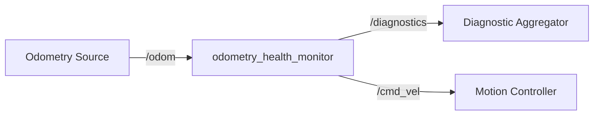

# odometry_health_monitor

## Overview

Monitors the `/odom` topic for staleness and publishes diagnostic status to `/diagnostics`. When odometry data becomes stale (exceeds configured timeout), the node publishes a zero-velocity command to `/cmd_vel` to halt the robot, preventing unsafe motion with unreliable localization. Without this package, the robot could continue moving with outdated position estimates, risking collisions or navigation failures.

## Node graph



## Nodes

### odometry_health_monitor_node

**Executable:** `odometry_health_monitor_node`

**Description:** Watchdog for odometry stream; publishes diagnostics and emergency stop commands on timeout.

#### Topics

| Topic | Type | Direction | Publisher | Subscriber |
|-------|------|-----------|-----------|------------|
| `/odom` | `nav_msgs/msg/Odometry` | Input | Odometry source (e.g., wheel encoders, SLAM) | `odometry_health_monitor` |
| `/diagnostics` | `diagnostic_msgs/msg/DiagnosticArray` | Output | `odometry_health_monitor` | Diagnostic aggregator, monitoring tools |
| `/cmd_vel` | `geometry_msgs/msg/Twist` | Output | `odometry_health_monitor` | Motion controller (emergency stop only) |

#### Parameters

| Parameter | Type | Default | Description |
|-----------|------|---------|-------------|
| `odom_timeout_sec` | `double` | `1.0` | Maximum age (seconds) of odometry before considered stale |
| `stop_on_timeout` | `bool` | `true` | Whether to publish zero-velocity command when odometry is stale |

## Common failures

| Symptom | Likely cause | How to diagnose | Fix |
|---------|--------------|-----------------|-----|
| Continuous ERROR diagnostics with `age_sec: inf` | No odometry publisher active | Check `ros2 topic list` for `/odom`; verify odometry source is running | Launch odometry source node (e.g., wheel encoder driver, SLAM node) |
| Intermittent ERROR diagnostics with increasing `age_sec` | Odometry publisher rate too slow or network congestion | Check `ros2 topic hz /odom`; verify rate > 1 Hz | Increase odometry publish rate or adjust `odom_timeout_sec` parameter |
| Robot stops unexpectedly during normal operation | `odom_timeout_sec` set too low for actual odometry rate | Check diagnostic messages for `age_sec` values near timeout threshold | Increase `odom_timeout_sec` to 2× expected odometry period |
| Robot continues moving despite stale odometry | `stop_on_timeout` disabled or `/cmd_vel` topic remapped | Verify parameter value; check `ros2 topic info /cmd_vel` for subscribers | Set `stop_on_timeout: true` in config; verify topic connections |

## Launch

### Basic launch

```bash
ros2 launch odometry_health_monitor odometry_health_monitor.launch.py
```

### Custom parameters

To adjust timeout threshold for a slower odometry source:

```bash
ros2 launch odometry_health_monitor odometry_health_monitor.launch.py \
  odom_timeout_sec:=2.0
```

To disable emergency stop (monitoring only):

```bash
ros2 launch odometry_health_monitor odometry_health_monitor.launch.py \
  stop_on_timeout:=false
```

### Integration with new robot

1. **Verify odometry topic name:** If your robot publishes odometry on a different topic (e.g., `/robot/odom`), add remapping to launch file:
   ```python
   remappings=[('/odom', '/robot/odom')]
   ```

2. **Tune timeout threshold:** Set `odom_timeout_sec` to 2-3× your odometry publish period. For 10 Hz odometry, use 0.2-0.3 seconds; for 1 Hz, use 2-3 seconds.

3. **Verify cmd_vel routing:** Ensure this node's `/cmd_vel` output reaches the motion controller. If multiple nodes publish to `/cmd_vel`, use a command multiplexer with priority handling.

4. **Test failure mode:** Stop the odometry source and verify the monitor publishes ERROR diagnostics and zero-velocity commands within the configured timeout.